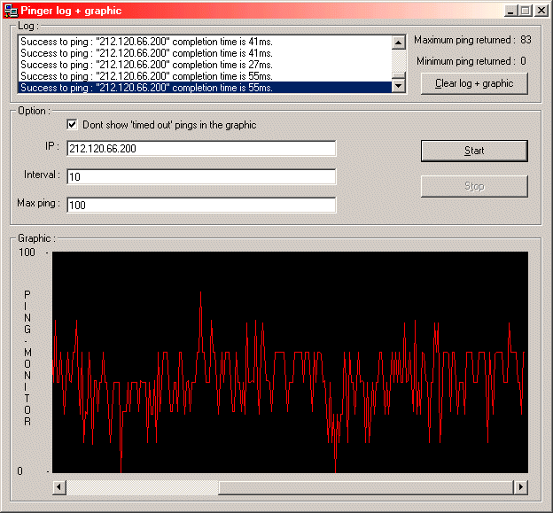



## Ping Graphic

### Description

PingGrap this prog makes a graphic from the ping that was returnet see screen shot

the egine (how to ping) is from some one else but i modifed a lot like no error codes but discritions

(Those discription maby not fully right but most of them do)

i wanted to use this to see when it is getting very busy on the net(you get peeks in the graphic).

i hope you like my code and vote for it and you give me a feedback. :-)
 
### More Info
 

             |
---                |---
**Submitted On**   |2001-02-02 13:40:30
**By**             |[egbert](https://github.com/Planet-Source-Code/PSCIndex/blob/master/ByAuthor/egbert.md)
**Level**          |Intermediate
**User Rating**    |4.9 (88 globes from 18 users)
**Compatibility**  |VB 5\.0, VB 6\.0
**Category**       |[Internet/ HTML](https://github.com/Planet-Source-Code/PSCIndex/blob/master/ByCategory/internet-html__1-34.md)
**World**          |[Visual Basic](https://github.com/Planet-Source-Code/PSCIndex/blob/master/ByWorld/visual-basic.md)
**Archive File**   |[CODE\_UPLOAD14422222001\.zip](https://github.com/Planet-Source-Code/egbert-ping-graphic__1-14924/archive/master.zip)

